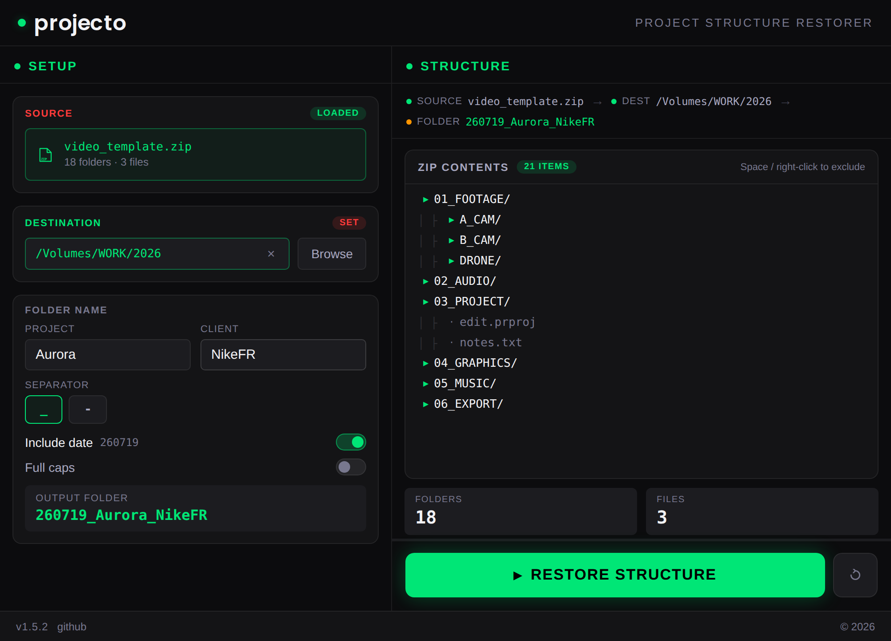

# projecto

Restore a full project folder structure from a ZIP template in seconds. Define your tree once, reuse it forever.



**Project Structure Restorer.** Folder naming: `YYMMDD_Project_Client`

---

## Build — macOS

```bash
chmod +x scripts/*.sh
./scripts/build-mac.sh
```

Or with npm:

```bash
npm run build              # Apple Silicon (arm64) DMG
npm run build:universal    # Universal (arm64 + x86_64)
npm run dev                # Dev preview, no build
```

---

## Build — Windows installer FROM macOS

```bash
./scripts/build-win-from-mac.sh
```

electron-builder cross-compiles a 64-bit NSIS installer natively — no Docker, no Wine.
On first run it downloads the Windows Electron binary (~100 MB). Or: `npm run build:win`.

---

## Windows installer features

- Custom install directory (no admin required)
- Desktop shortcut
- Start Menu entry under **just edit -> projecto**
- GPL license shown in the installer
- Clean uninstaller
- Bilingual (English / French)

---

## Project structure

```
projecto/
├── electron-builder.yml      <- build configuration
├── package.json
├── scripts/
│   ├── build-mac.sh          <- macOS DMG build
│   ├── build-win-from-mac.sh <- Windows installer from macOS (native)
│   ├── dev.sh                <- dev preview
│   ├── make-icon.sh          <- regenerate icon.icns
│   ├── make-icon-win.sh      <- regenerate icon.ico
├── build-resources/
│   ├── icon.icns
│   ├── icon.ico
│   ├── entitlements.mac.plist
│   └── license.txt           <- GPL, shown in installer
├── READ ME FIRST.txt         <- macOS first-launch note
├── version.json              <- update feed
└── src/
    ├── main.js
    ├── preload.js
    ├── index.html
    └── vendor/jszip.min.js   <- bundled locally (runs offline)
```

---

© 2026 just edit

---

## Publishing to GitHub

From the project folder:

```bash
git init && git add . && git commit -m "projecto 1.5.1"
git remote add origin https://github.com/noar-justedit/projecto.git
git push -u origin main
git tag v1.5.1 && git push --tags
```

Tags (e.g. `v1.5.1`) are used to mark releases; builds are produced manually with the
scripts above, then attached to the corresponding GitHub release.

---

## Releasing an update

The app checks `version.json` (raw GitHub, `main` branch) at launch and shows an
in-app notice when a newer version is available. To publish an update:

1. Bump `"version"` in `package.json` and build the new binaries.
2. Create a GitHub release with the matching tag (e.g. `v1.5.2`) and attach the binaries.
3. Edit `version.json` so `"version"` matches the new release, then commit to `main`.

Note: raw GitHub is CDN-cached (~5 min), so the notice may lag slightly after the commit.

---

## License

projecto is free software, released under the **GNU General Public License v3.0**.
See the [LICENSE](LICENSE) file for the full text.

Copyright (C) 2026 just edit

The logo uses the **Poppins** typeface (SIL Open Font License 1.1), see `src/assets/fonts/Poppins-OFL.txt`.
